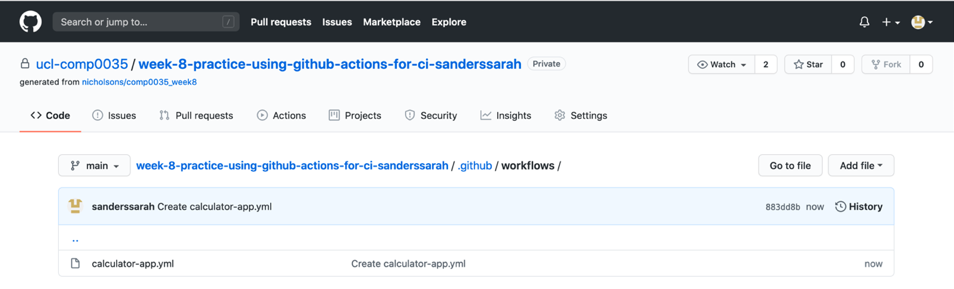
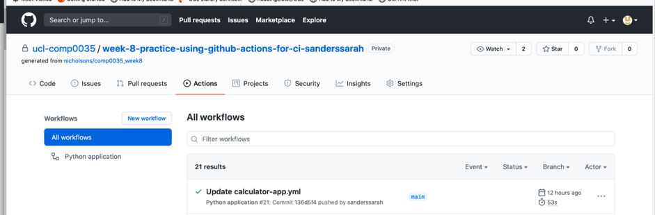
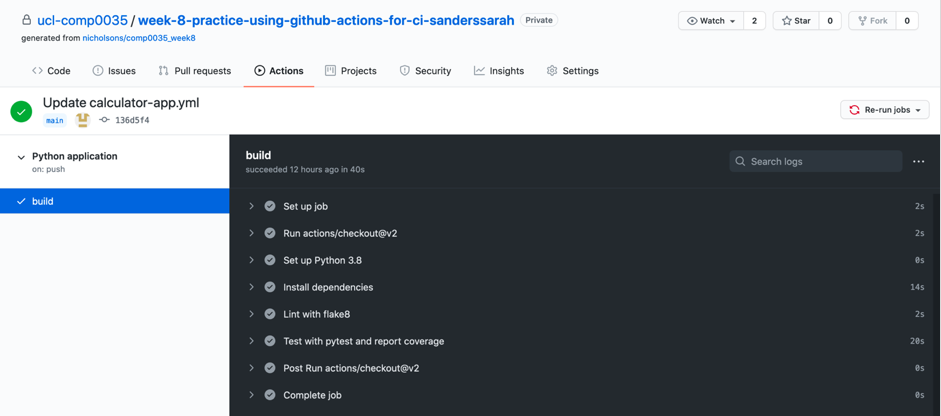
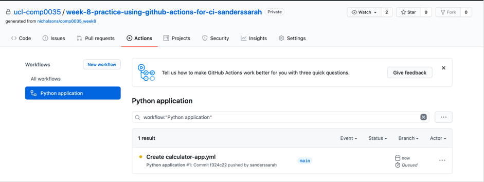
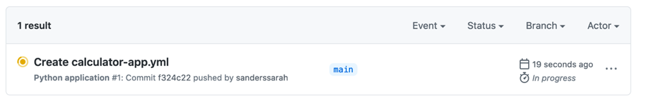
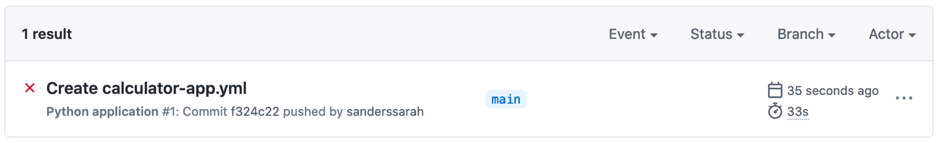
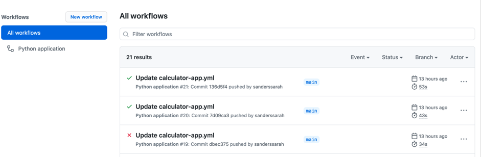
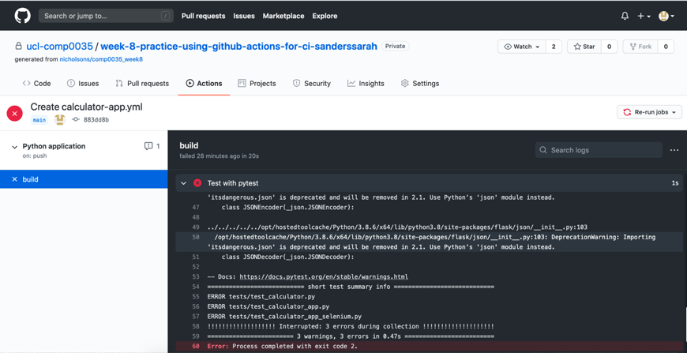

# Using GitHub actions for CI and Linting

The use of GitHub actions was already covered in COMP0035. This activity is only a reminder of that (so is less
detailed).

The only difference is that to run Selenium browser tests in GitHub actions you need to remember to change the driver
fixture has the following line is not commented out, i.e.: `options.add_argument("--headless")`.

## Create the workflows to automatically run your tests using a GitHub template

Steps:

- Go to your repository on GitHub.
- Go to the Actions tab.
- Find ‘Python application’ and click on ‘Set up this workflow’
- This automatically creates a file called python-app.yml in your repository. You can name this differently if you wish,
  for example paralympics-app.yml. Press 'start commit'.
- When prompted select 'Commit new file'.
- You should see the file added to the .github/workflows directory of your repository.
- Open the .yml file you just created and have a look at the code.

You may want to refer to the GitHub documentation that explains what each of the key words mean. The syntax is YAML, a
structured text.

```yaml

# This workflow will install Python dependencies, run tests and lint with a single version of Python
# For more information see: https://help.github.com/actions/language-and-framework-guides/using-python-with-github-actions

name: Python application
```

name helps you to identify the overall workflow and sections within it. The first name is for the workflow itself and is
what will appear in your list of workflows seen when you click on the Actions tab in GitHub:



The names within the steps show the name of those steps. The screenshot below shows the results of one of the automated
tests, you should see in the black area that there are sections that relate to each of the step names. Make sure you use
meaningful names in your .yml!



on indicates when the workflow should run. In this case when there is a push to the main branch or a pull request on the
main branch.

```yaml
on:
  push:
    branches: [ main ]
  pull_request:
    branches: [ main ]
```

The ‘jobs’ section lists the actions to carry out and is further subdivided (note the indentations, these have meaning
and you will get errors if you don’t indent appropriately). The actions will run in a virtual machine on GitHub’s
infrastructure. The virtual machine is ubuntu. You do not need to change runs-on for this activity, though you can see
the other options in the documentation. You might change this if the server you intend to deploy on isn’t linux.

```yaml
jobs:
  build:

    runs-on: ubuntu-latest
```

You can have any number of steps in your job. Some parameters are optional, so for some you may see ‘uses’, ‘name’,
’with’ and ‘run’, for others you may just have ‘run’. Refer to the reference for the details of these, the following is
a high level overview of what the steps do. The first part checks out the code in your repository to use is:

```yaml
    steps:
      - uses: actions/checkout@v2
```

The following sets up the version of Python to use (you may want to change this).

```yaml

- name: Set up Python 3.9
  uses: actions/setup-python@v2
  with:
    python-version: 3.9
```

The next part installs the dependencies. It first installs pip as this is what is used to install the rest of the
packages. It is then installing flake8 carries out checks on the syntax of your Python code) and pytest. It then
installs all the requirements that are listed in requirements.txt (if there is a requirements.txt, which there is for
this example repo). Make sure that pytest-cov and selenium are included in requirements.txt if you are using these.

```yaml

- name: Install dependencies
  run: |
    python -m pip install --upgrade pip
    pip install flake8 pytest
    if [ -f requirements.txt ]; then pip install -r requirements.txt; fi
```

Having installed the necessary dependencies it now carries out the tasks. The first is to use flake8 to check the code
syntax. If there are issues with your code it should fail before starting to run the tests.

```yaml
    - name: Lint with flake8
      run: |
        # stop the build if there are Python syntax errors or undefined names
        flake8 . --count --select=E9,F63,F7,F82 --show-source --statistics
        # exit-zero treats all errors as warnings. The GitHub editor is 127 chars wide
        flake8 . --count --exit-zero --max-complexity=10 --max-line-length=127 –statistics
```

Assuming the build was successful in the previous step then run the tests. The default .yml only includes pytest, I have
updated this to make the test report verbose and to also provide a coverage report.

```yaml
    - name: Test with pytest and report coverage
      run: |
        pytest --verbose --cov-report=term-missing --cov=paralympics_app
```

## Review the status of the workflow

To see the results of the workflow go to Actions and select the Python application on the left side. If the test is
still to be run, or is still running you will see and amber coloured circle next to the workflow job and the status is
shown in the Branch column. In the following screenshot the status is ‘Queued’ meaning that it is waiting on GitHub’s
servers but hasn't run yet.



In the following the actions are in progress.



Once the workflow has finished you will see either a red cross (as below)
meaning it failed, or a green tick meaning it was successful.



To see the details of what happened, click on the workflow job (e.g. the one with the red cross in the screenshot
below):



Then click on build on the left side menu:



You should then be able to expand the section in the black window pane that has a red cross next to it to see the
details. You will need to review the error messages to try and understand what went wrong:



## Test the workflow by making a change to the code

Edit one of the files in your repository. You can do this directly in GitHub unless you have set-up the repository as a
project in your IDE (e.g. PyCharm). Perhaps introduce a bug in the code (e.g. make one of the calculator functions such
as Add fail). Commit and push the change (or just commit if you are working directly in GitHub). When the change has
been pushed the workflow should start automatically. Go to the GitHub for the repository, click on the Actions tab and
watch the progress of the test. Once the test has finished go and review the details (as per step 4 of this document).
